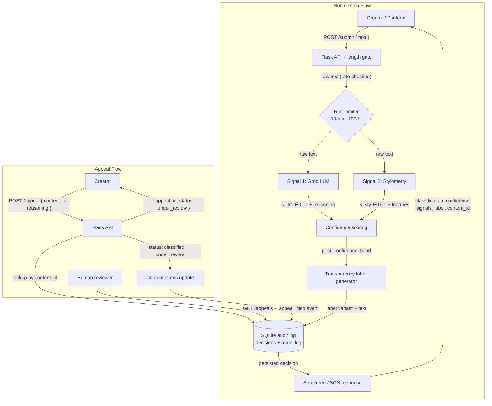

# Provenance Guard — Planning

A backend attribution service that any creative-sharing platform can plug into.
It accepts a piece of text, classifies it as **likely human-written**, **likely
AI-generated**, or **uncertain**, scores its confidence in that classification,
returns a plain-language transparency label, and lets creators appeal a decision.

This document is the spec. It covers Milestone 1 (architecture narrative,
signals, false-positive trace, API surface, diagram) and Milestone 2 (the five
required spec questions, the architecture section, and the AI tool plan).

---

## 1. Architecture Narrative — the path a single piece of text takes

A creator (or the platform on their behalf) sends text to **`POST /submit`**.
Here is every component the text touches, in order:

1. **Flask API layer** receives the request and validates it: the body must
   contain a non-empty `text` field. A **length gate** runs first — text shorter
   than the minimum (~40 words) is too short for either signal to be reliable, so
   it is short-circuited to an `uncertain` result with an `insufficient_evidence`
   note (see Edge Cases).

2. **Rate limiter (Flask-Limiter)** checks the caller's IP against the configured
   limits *before* any expensive work happens. Over-limit requests get `429`.

3. **Signal 1 — Groq LLM classifier.** The raw text is sent to Groq
   (`llama-3.3-70b-versatile`) with a structured prompt asking it to judge the
   probability the text is AI-generated and return a JSON object
   `{ "p_ai": 0.0–1.0, "reasoning": "..." }`. This captures *semantic and
   stylistic coherence* holistically.

4. **Signal 2 — Stylometric heuristics.** In parallel/independently, the raw text
   runs through a pure-Python analyzer that computes measurable statistical
   properties (sentence-length variance / "burstiness", type-token ratio,
   punctuation density, mean sentence length) and maps them to a stylometric
   `p_ai` in `[0,1]`. This captures *structural* properties, not meaning.

5. **Confidence scoring.** The two signal scores are blended into a single
   `p_ai`, adjusted for signal *disagreement* (when the two signals strongly
   disagree, the score is pulled toward 0.5 / "uncertain"), and converted to a
   `confidence` value and a label band. See §2.2 for the exact math.

6. **Transparency label generator.** The label band (`high_confidence_ai`,
   `high_confidence_human`, `uncertain`) selects one of three label templates and
   fills in the confidence percentage. This is the human-facing text.

7. **Audit log (SQLite).** The decision — content id, both raw signal scores,
   blended `p_ai`, confidence, label variant, model id, and timestamp — is written
   to a structured `decisions` table and an append-only `audit_log` table. Nothing
   is returned to the caller until the decision is durably logged.

8. **Response.** The API returns the structured result: classification,
   confidence, per-signal breakdown, the label text, the content's status, and the
   `content_id` the creator will use to appeal.

**Appeal flow.** Later, a creator who disagrees calls **`POST /appeal`** with the
`content_id` and their reasoning. The API looks up the original decision, writes
an **appeal** record linked to that decision, flips the content's `status` to
`under_review`, and appends the appeal to the audit log. A reviewer reads the
queue via **`GET /appeals`**. No automated re-classification happens — a human
decides.

---

## 2. The Five Required Spec Questions

### 2.1 Detection signals

The system uses **two genuinely independent signals** — one semantic, one
structural — so the combination is more informative than either alone.

| | Signal 1 — Groq LLM classifier | Signal 2 — Stylometric heuristics |
|---|---|---|
| **What it measures** | Holistic semantic & stylistic "feel": does the prose read as machine-fluent (even, hedged, generically coherent) or human (idiosyncratic, opinionated, occasionally rough)? | Statistical shape of the text: sentence-length variance (burstiness), type-token ratio (vocabulary diversity), punctuation density, mean sentence length. |
| **Why it differs human vs AI** | LLMs produce text that is unusually internally consistent and tonally smooth; the model has seen vast AI and human text and can pick up subtle distributional cues a formula can't. | AI text tends to be **more uniform**: similar sentence lengths, "safe" balanced vocabulary, regular punctuation. Human writing is **burstier** — long sentences next to fragments, repeated favorite words, irregular punctuation. |
| **Output** | JSON `{ p_ai: 0–1, reasoning: str }` | `{ p_ai: 0–1, features: {...} }` where `p_ai` is derived from the features. |
| **Blind spot** | Non-deterministic; depends on an external API (if Groq is down, this signal is unavailable — see Edge Cases); can be fooled by "humanizer" paraphrase tools; biased toward flagging *formal, polished* human writing as AI; weak on very short text. | Breaks on poetry/experimental forms, lists, and any genre with naturally uniform structure (technical docs, legal text); unreliable on short text (variance is noisy); tuned for English prose, so it misreads code, non-English, or heavily formatted text. |

The two blind spots barely overlap: the formula is fooled by *structure* (a
repetitive poem), the LLM is fooled by *style laundering* (a paraphrased AI text).
That non-overlap is exactly why combining them — and watching their
disagreement — produces a more honest confidence estimate.

**How they combine.** Both signals emit `p_ai ∈ [0,1]`. We blend with a weight
favoring the holistic LLM signal, then dampen by disagreement (§2.2).

### 2.2 Uncertainty representation

We do **not** return a bare binary. The pipeline produces a continuous `p_ai`, a
`confidence` value, and a label band.

```
s_llm  = LLM p_ai            ∈ [0,1]
s_sty  = stylometric p_ai    ∈ [0,1]

p_blend = 0.60 * s_llm + 0.40 * s_sty      # LLM weighted higher (holistic)
d       = |s_llm - s_sty|                  # signal disagreement, 0..1

# Disagreement penalty: when signals disagree, pull p toward 0.5 (uncertain)
p_ai    = 0.5 + (p_blend - 0.5) * (1 - d)

confidence = |p_ai - 0.5| * 2              # 0 = coin-flip, 1 = certain
```

**What `p_ai = 0.6` means to the system:** "slightly leaning AI, but barely above
a coin flip." With `p_ai = 0.6`, `confidence = 0.2` — low. It lands in the
**uncertain** band and the label says so. A `p_ai = 0.95` gives `confidence = 0.9`
and a confident AI label. This is the "0.51 ≠ 0.95" requirement made concrete.

**Thresholds (label bands):**

| Condition | Band | Classification |
|---|---|---|
| `p_ai ≥ 0.70` | `high_confidence_ai` | Likely AI-generated |
| `p_ai ≤ 0.30` | `high_confidence_human` | Likely human-written |
| `0.30 < p_ai < 0.70` | `uncertain` | Inconclusive |

The disagreement term is what makes the score *calibrated rather than naive*: two
confident-but-opposed signals (e.g. LLM says 0.9 AI, stylometry says 0.1 AI →
`d = 0.8`) collapse toward `p_ai ≈ 0.5` and correctly land in "uncertain" instead
of a falsely confident verdict.

**How we'll test that scores are meaningful** (to be executed in M4): assemble a
small labeled set — clearly-AI samples (ask an LLM to write a blog post),
clearly-human samples (pre-2020 published prose), and known-hard samples
(repetitive poem, polished human essay). Confirm clearly-AI text scores high
`p_ai`, clearly-human scores low, and hard cases land in the uncertain band with
lower confidence. Spot-check that nudging text toward uniformity raises the
stylometric score.

### 2.3 Transparency label design

Three variants. The reader is non-technical, so each label states the verdict in
plain language, shows a confidence percentage, and explicitly frames the result as
an *automated estimate, not a verdict of fact* — and points to the appeal path.
`{confidence}` is filled with `round(confidence * 100)`.

**High-confidence AI** (`high_confidence_ai`):
> 🤖 **Likely AI-generated.** Our automated analysis indicates this content was
> probably created with significant AI assistance (confidence: {confidence}%).
> This is an estimate from automated signals, not a certainty. If you're the
> creator and believe this is wrong, you can appeal this label.

**High-confidence human** (`high_confidence_human`):
> ✍️ **Likely human-written.** Our automated analysis found no strong signs of AI
> generation in this content (confidence: {confidence}%). This is an estimate from
> automated signals, not a guarantee.

**Uncertain** (`uncertain`):
> ❓ **Attribution uncertain.** Our automated analysis couldn't confidently tell
> whether this content was written by a human or generated with AI (confidence in
> a verdict: {confidence}%). Treat this as inconclusive — no attribution claim is
> being made.

### 2.4 Appeals workflow

- **Who can appeal:** the creator of a submitted piece, identified by the
  `content_id` returned at submission. (In this reference implementation, holding
  the `content_id` is sufficient; a production platform would bind appeals to the
  authenticated account that owns the content.)
- **What they provide:** `content_id` (required), `reasoning` — free-text
  explanation of why they believe the classification is wrong (required), and an
  optional `creator_id`/contact.
- **What the system does on receipt:**
  1. Look up the original decision by `content_id`; `404` if unknown.
  2. Create an `appeal` row linked to the decision (`appeal_id`, content_id,
     reasoning, timestamp, `status = open`).
  3. Update the content's `status` from `classified` → `under_review`.
  4. Append an `appeal_filed` event to the audit log, referencing the original
     decision id so the appeal sits alongside the decision it contests.
  5. Return `{ appeal_id, content_id, status: "under_review", logged_at }`.
  6. **No automated re-classification** — a human reviewer owns the next step.
- **What a reviewer sees** (`GET /appeals`): a queue of open appeals, each showing
  the original text, both signal scores, the blended `p_ai` and confidence, the
  label that was shown, the creator's reasoning, and timestamps — everything
  needed to make a call without leaving the queue.

### 2.5 Anticipated edge cases

1. **Repetitive, simple-vocabulary poem** (nursery rhyme, villanelle with refrains,
   minimalist verse). Low type-token ratio + low sentence-length variance →
   **stylometry scores it as AI** (`s_sty` high). But it's human art. The LLM
   signal will usually recognize it as creative/human (`s_llm` low). High
   disagreement (`d` large) → the disagreement penalty pulls `p_ai` toward 0.5 →
   the piece lands in **uncertain**, *not* a false high-confidence-AI label, and
   the creator can appeal. This is the system working as designed, not failing.

2. **Very short text** (< ~40 words, a couplet or a one-line caption). Stylometric
   variance is undefined/noisy and the LLM is also unreliable on tiny inputs. The
   **length gate** in the API layer short-circuits these to `uncertain` with an
   `insufficient_evidence` note, rather than emitting a confident verdict from
   thin data.

3. **AI text run through a "humanizer" / heavy human editing of AI draft** (and its
   mirror, a human essay polished by Grammarly). Genuinely ambiguous provenance:
   the LLM may flag it AI while stylometry reads human, or vice-versa. Again,
   disagreement widens the uncertainty band — the honest answer is "uncertain,"
   which the label states plainly.

4. **Non-prose input** — code, heavily formatted markdown, non-English text. The
   stylometric heuristics are tuned for English prose and will misread these; the
   blended score should be treated cautiously. (Out of primary scope; documented
   as a known limitation.)

**Operational blind spot (from the "Groq live-only" decision):** the LLM signal is
a hard dependency on an external API. If Groq is unreachable or returns malformed
output, `/submit` returns a `502`/`503` rather than silently degrading to a
single-signal verdict — single-signal detection is explicitly not acceptable, so
the system fails loud instead of quietly downgrading.

---

## 3. API Surface (the contract)

| Method & path | Accepts | Returns |
|---|---|---|
| `POST /submit` | `{ "text": str, "creator_id"?: str }` | `{ content_id, classification, confidence, p_ai, signals: { llm: {p_ai, reasoning}, stylometry: {p_ai, features} }, label: { variant, text }, status, model, timestamp }` |
| `POST /appeal` | `{ "content_id": str, "reasoning": str, "creator_id"?: str }` | `{ appeal_id, content_id, status: "under_review", logged_at }` |
| `GET /appeals` | — | `[ { appeal_id, content_id, original_text, signals, p_ai, confidence, label_variant, reasoning, status, filed_at } ]` (reviewer queue) |
| `GET /log` | `?limit=N` (optional) | `[ { event, content_id, p_ai, confidence, signals, label_variant, timestamp, ... } ]` (audit log, newest first) |
| `GET /content/<content_id>` | — | current `{ content_id, status, classification, confidence, label }` |
| `GET /health` | — | `{ status: "ok" }` |

**Submission response example (shape):**
```json
{
  "content_id": "c_9f2a...",
  "classification": "likely_ai",
  "confidence": 0.84,
  "p_ai": 0.92,
  "signals": {
    "llm":        { "p_ai": 0.95, "reasoning": "Even cadence, hedged claims, no personal voice." },
    "stylometry": { "p_ai": 0.88, "features": { "sentence_len_variance": 4.1, "type_token_ratio": 0.42, "punct_density": 0.03, "mean_sentence_len": 18.6 } }
  },
  "label": {
    "variant": "high_confidence_ai",
    "text": "🤖 Likely AI-generated. Our automated analysis indicates ... (confidence: 84%). ..."
  },
  "status": "classified",
  "model": "llama-3.3-70b-versatile",
  "timestamp": "2026-06-30T12:00:00Z"
}
```

---

## 4. Rate Limiting (planned values)

Applied to `POST /submit` per client IP via Flask-Limiter:

| Limit | Value | Reasoning |
|---|---|---|
| Short burst | **10 / minute** | Each submit triggers a Groq LLM call — real latency and quota cost. 10/min is comfortably above interactive human use (reading a label, deciding to submit the next piece) but blocks scripted hammering. |
| Sustained | **100 / hour** | Caps a single IP's daily Groq spend and protects the shared API quota from one noisy tenant, while leaving plenty of headroom for a legitimate platform integration test session. |

Read endpoints (`/log`, `/appeals`, `/content`, `/health`) are not rate-limited in
the reference build (no external cost), though a production deployment would add a
generous default. Over-limit requests receive `429 Too Many Requests`. Final
chosen values are restated in the README.

---

## Architecture



**Narrative.** *Submission:* raw text enters `POST /submit`, passes the length gate
and rate limiter, then fans out to the Groq LLM signal and the stylometric signal;
their two `p_ai` scores are blended (with a disagreement penalty) into a single
`p_ai` + `confidence`, which selects one of three transparency labels; the full
decision is persisted to the SQLite audit log before a structured JSON response is
returned. *Appeal:* `POST /appeal` looks up the original decision by `content_id`,
records the creator's reasoning, flips the content's status to `under_review`, and
logs an `appeal_filed` event — a human reviewer then works the queue via
`GET /appeals`. No automated re-classification occurs.

---

## AI Tool Plan

For each implementation milestone: which spec sections feed the AI tool, what to
ask it to generate, and how to verify the output.

### M3 — Submission endpoint + first signal
- **Spec provided:** §2.1 Detection signals (LLM signal row), §3 API surface, the
  Architecture diagram, §4 rate limiting.
- **Ask it to generate:** a Flask app skeleton (`app.py`), the `POST /submit` route
  with request validation and the length gate, Flask-Limiter wired with the chosen
  limits, and the Groq LLM signal function returning `{ p_ai, reasoning }` from a
  structured prompt.
- **How to verify:** call the LLM signal function directly on 3–4 sample texts
  (one obviously AI, one obviously human) *before* wiring it into the endpoint;
  confirm it returns parseable JSON in `[0,1]`. Then hit `/submit` with curl and
  confirm the response shape matches §3, and that a `429` appears past the limit.

### M4 — Second signal + confidence scoring
- **Spec provided:** §2.1 (stylometry row), §2.2 Uncertainty representation, the
  diagram.
- **Ask it to generate:** the pure-Python stylometric analyzer (sentence-length
  variance, type-token ratio, punctuation density, mean sentence length →
  `s_sty`), and the scoring function implementing the blend, disagreement penalty,
  `confidence`, and band thresholds from §2.2.
- **How to verify:** run the labeled-set test from §2.2 — confirm clearly-AI text
  yields high `p_ai`, clearly-human yields low, and the repetitive-poem / polished-
  essay hard cases land in the **uncertain** band with lower confidence. Check that
  `confidence` for `p_ai=0.6` is meaningfully smaller than for `p_ai=0.95`.

### M5 — Production layer (labels, appeals, audit log)
- **Spec provided:** §2.3 Label variants, §2.4 Appeals workflow, §3 API surface,
  the diagram.
- **Ask it to generate:** the label generator mapping band → exact label text from
  §2.3, the SQLite schema (`decisions`, `appeals`, `audit_log`) + logging calls,
  the `POST /appeal` endpoint, and the `GET /appeals` / `GET /log` read endpoints.
- **How to verify:** craft inputs that reach all three label variants and confirm
  each renders the correct verbatim text; file an appeal and confirm the content's
  status flips to `under_review`, an `appeal_filed` row appears in the audit log
  linked to the original decision, and the appeal shows up in `GET /appeals`.
  Confirm `GET /log` returns at least 3 structured entries.
